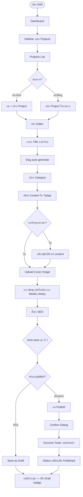
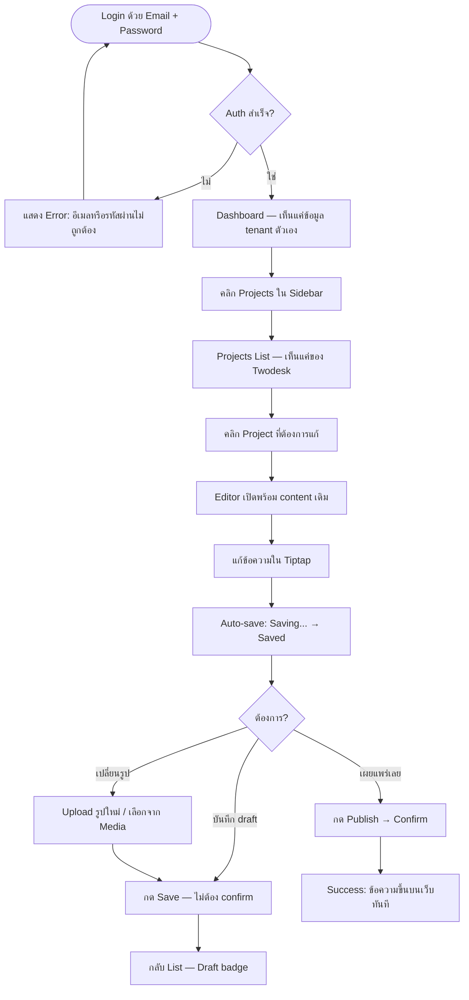
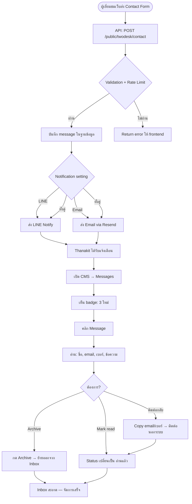

# UX Design Specification — Best Solutions CMS

**Author:** Thanakit
**Date:** 2026-04-08

---

## Visual Reference & Design Direction

### Reference: Flup Dashboard
- Layout: Left sidebar + main content area
- Sidebar: Collapsible, grouped menu sections, user profile at bottom, dark mode toggle
- Content: Stats cards row at top, charts/data below
- Style: Clean, minimal, strong typography hierarchy

### Color Direction: Monochrome (Black & White)
- โทนขาวดำเป็นหลัก — เรียบหรู สะอาด professional
- พื้นหลัง: ขาว (#FFFFFF) + เทาอ่อน (#F5F5F5) สำหรับ section แยก
- Sidebar: ดำ/เทาเข้ม
- Text: ดำ (#111) + เทา (#666) สำหรับ secondary
- Accent: เลือกภายหลัง (อาจเป็นสีเดียวสำหรับ active state / CTA)

### CMS-Specific Adaptations
- Sidebar groups: Content (Projects, Blog, Pages), Communication (Messages), Assets (Media), System (Settings, Analytics)
- Tenant switcher: ด้านบน sidebar สำหรับ super admin
- Stats cards: จำนวน projects, articles, unread messages

---

## Executive Summary

### Project Vision

Best Solutions CMS คือ Multi-tenant Headless CMS กลาง ที่จะทำให้ Thanakit จัดการ content ของทุก client จากที่เดียว — ไม่ต้อง login หลายระบบ ไม่ต้อง copy paste ข้ามระบบ และลูกค้าที่ต้องการก็แก้ content เล็กๆ น้อยๆ ได้เอง ระบบ replace WordPress ด้วย custom-coded frontend ที่เร็วกว่า เบากว่า

### Target Users

**Primary — Thanakit (Super Admin / Agency Owner)**
- จัดการ content ให้ลูกค้าทุกเจ้าจากที่เดียว
- Switch ระหว่าง tenant ได้ทันที
- Onboard ลูกค้าใหม่ได้เร็ว
- ใช้ Desktop เป็นหลัก
- Tech level สูง — ต้องการ efficiency ไม่ใช่ simplicity

**Secondary — Client Admin (เช่น คุณแพร, Twodesk)**
- แก้ content เล็กๆ เอง — เปลี่ยนข้อความ รูป เพิ่ม blog post
- เคยใช้ WordPress/Canva — ต้องการ UI ที่ intuitive ใช้ได้เลย
- Desktop เป็นหลัก แต่บางครั้งอาจแก้จากมือถือ
- Tech level ปานกลาง — กลัวกดผิดพัง ต้องให้ความมั่นใจ

**Tertiary — Frontend Developer**
- เชื่อมต่อ Public API กับ frontend ของ client
- ต้องการ API ที่ consistent, documented, predictable

### Key Design Challenges

1. **Two audiences, one UI** — Super admin ต้องการ power & speed, client admin ต้องการ simplicity & safety ต้องออกแบบให้ทั้งสองกลุ่มใช้ UI เดียวกันได้อย่างสมดุล
2. **Tenant switching ต้องไม่สับสน** — Super admin switch ไปมาระหว่าง client ต้องชัดเจนเสมอว่า "กำลังทำงานให้ใคร" ป้องกันแก้ผิด tenant
3. **Mobile responsive สำหรับ client admin** — Desktop-first แต่ต้อง responsive พอให้แก้ content เบื้องต้นจากมือถือได้ (ไม่ใช่ full editing experience)
4. **Multi-locale content ต้องไม่ซับซ้อน** — JSONB locales (th/en) ต้อง present ในรูปแบบที่เข้าใจง่าย ไม่ overwhelm ผู้ใช้

### Design Opportunities

1. **"แก้เสร็จเห็นผลเลย"** — ลูกค้า self-service แก้ content แล้วเห็นบนเว็บทันที ความรู้สึก empowerment นี้คือ killer UX
2. **Contextual simplicity** — ซ่อน features ที่ tenant ไม่ได้เปิดใช้ (feature flags) ทำให้ UI ของแต่ละ client มีแค่สิ่งที่เกี่ยวข้อง — clean, focused
3. **Agency-grade efficiency** — Tenant switcher + keyboard shortcuts + bulk operations จะทำให้ Thanakit ทำงานเร็วขึ้นมาก เมื่อเทียบกับ login หลายระบบ

---

## Core User Experience

### Defining Experience

**Core Action: สร้างและแก้ไข Content ได้ลื่นไหล**

สิ่งที่ผู้ใช้ทำบ่อยที่สุดคือ "เปิด editor → แก้/สร้าง content → save" — ทั้งการสร้างบทความ SEO ใหม่ให้ลูกค้า และการแก้ไขข้อมูลสินค้า/project ที่มีอยู่ ถ้า flow นี้ลื่น ทุกอย่างจะตามมา

**Content editing ต้อง:**
- เปิด editor แล้วพร้อมพิมพ์ได้ทันที — ไม่ต้องรอ load
- Save ได้เร็ว ไม่มี friction (auto-save + manual save)
- สลับระหว่างภาษา (th/en) ได้ในที่เดียว ไม่ต้องเปิดหน้าใหม่
- Upload รูปลาก drop ได้เลยใน editor

### Platform Strategy

| Platform | ระดับ | รายละเอียด |
|----------|-------|-----------|
| **Desktop Web** | Primary | ประสบการณ์เต็มรูปแบบ — editor, media library, dashboard |
| **Mobile Web** | Secondary | แก้ content เบื้องต้น, ดู messages, อ่าน dashboard |
| **Offline** | ไม่จำเป็น | ผู้ใช้มีเน็ตเสถียร ไม่ต้อง offline support |

- Mouse/keyboard เป็นหลัก — Tiptap editor ออกแบบสำหรับ desktop
- Mobile responsive สำหรับ quick edits เท่านั้น

### Effortless Interactions

**ต้อง effortless (ไม่ต้องคิด):**
- เปิดหน้า content → เห็น editor พร้อมใช้ทันที
- พิมพ์แล้ว auto-save — ไม่ต้องกลัวข้อมูลหาย
- Upload รูปแค่ลาก drop — optimize + thumbnail อัตโนมัติ
- Slug auto-generate จาก title — ไม่ต้องพิมพ์เอง
- Feature flags ซ่อน menu ที่ไม่เกี่ยว — UI ไม่รกสายตา

**ต้อง automatic (ระบบทำให้):**
- Content revision บันทึกทุกครั้งที่แก้
- Thumbnail สร้างอัตโนมัติเมื่อ upload รูป
- SEO fields pre-fill จาก title/description

### Critical Success Moments

1. **"Wow moment" สำหรับลูกค้า** — เปิด CMS ครั้งแรก เห็น UI ที่สวย professional ดูเป็นระบบใหญ่ — รู้สึกว่า "คุ้มค่า" กับราคาที่จ่าย ไม่ใช่ admin panel ถูกๆ
2. **"ง่ายกว่า WordPress" moment** — คลิกแก้ content แล้ว save ได้เลย ไม่มี menu 100 อันมาให้สับสน
3. **"ทำเสร็จเร็วมาก" moment สำหรับ Thanakit** — สร้างบทความ SEO ใหม่ให้ลูกค้า publish ได้ภายในไม่กี่นาที จากที่เดียว

### Experience Principles

1. **"เปิดแล้วทำได้เลย"** — ทุก action สำคัญต้องเข้าถึงภายใน 2 คลิก ไม่มี loading ที่รู้สึกได้
2. **"ดูแพง ใช้ง่าย"** — UI ขาวดำ สะอาด professional ให้ความรู้สึกว่าเป็นระบบคุณภาพ แต่ใช้งานง่ายไม่ซับซ้อน
3. **"ไม่ต้องกลัวพัง"** — Auto-save, revision history, soft delete — ทำให้ผู้ใช้กล้าแก้ content โดยไม่กังวล
4. **"เห็นแค่สิ่งที่เกี่ยวข้อง"** — Feature flags + role-based UI ทำให้แต่ละ user เห็นแค่สิ่งที่ต้องใช้

---

## Desired Emotional Response

### Primary Emotional Goals

| ความรู้สึก | สำหรับใคร | เมื่อไหร่ |
|------------|----------|----------|
| **ประทับใจ & ภูมิใจ** | ลูกค้า (Client Admin) | เปิด CMS ครั้งแรก — "ระบบนี้ดูดี ดูแพง เว็บเราเป็นมืออาชีพ" |
| **มั่นใจ & ควบคุมได้** | ทุกคน | ใช้งานทั่วไป — "รู้ว่าต้องกดตรงไหน ไม่มีทางพลาด" |
| **สบายใจ & ผ่อนคลาย** | ลูกค้า (Client Admin) | แก้ content เสร็จ — "ง่ายจัง ไม่เครียดเลย" |
| **มีประสิทธิภาพ & เร็ว** | Thanakit (Super Admin) | ทำงานประจำวัน — "ทำเสร็จเร็วมาก จากที่เดียว" |

### Emotional Journey Mapping

| ช่วงเวลา | ความรู้สึกที่ต้องการ |
|----------|-------------------|
| **เปิด CMS ครั้งแรก** | ประทับใจ — UI สวย professional ดูเป็นระบบใหญ่ คุ้มค่า |
| **เริ่มใช้งาน** | มั่นใจ — รู้ทันทีว่าต้องทำอะไร menu ชัดเจน ไม่หลงทาง |
| **กำลังแก้ content** | สบายใจ — editor ลื่น auto-save ทำงานอยู่ ไม่ต้องกลัวข้อมูลหาย |
| **Save / Publish สำเร็จ** | พอใจ — feedback ชัด รู้ว่าสำเร็จแล้ว เห็นผลทันที |
| **เกิดข้อผิดพลาด** | สงบ — ระบบบอกชัดว่าเกิดอะไร แนะนำวิธีแก้ ไม่ panic |
| **กลับมาใช้อีกครั้ง** | คุ้นเคย — จำได้ว่าอะไรอยู่ตรงไหน เข้าใช้แล้วทำได้เลย |

### Micro-Emotions

**ต้องสร้าง:**
- **Confidence** — ทุก action มี visual feedback ชัดเจน (save สำเร็จ, upload เสร็จ, publish แล้ว)
- **Trust** — auto-save + revision history ทำให้รู้ว่าข้อมูลปลอดภัยเสมอ
- **Accomplishment** — สร้าง/แก้ content เสร็จ → เห็น success state ที่ให้ความรู้สึกว่า "ทำสำเร็จแล้ว"

**ต้องหลีกเลี่ยง:**
- **Confusion** — ไม่มี menu ที่ไม่จำเป็น ไม่มี technical jargon
- **Anxiety** — ไม่มี destructive action ที่ไม่ confirm ก่อน ไม่มี "กดแล้วย้อนไม่ได้"
- **Overwhelm** — feature flags ซ่อนสิ่งที่ไม่เกี่ยวข้อง UI ไม่รก

### Design Implications

| ความรู้สึก | UX Design Approach |
|------------|-------------------|
| ประทับใจ | โทนขาวดำ minimal, typography ชัด, spacing เยอะ, ดู premium |
| มั่นใจ | Label ชัดเจน, breadcrumb navigation, active state ชัด, tenant indicator โดดเด่น |
| สบายใจ | Auto-save indicator, undo support, soft delete (กู้คืนได้), confirmation dialog ก่อน destructive action |
| มีประสิทธิภาพ | Keyboard shortcuts, quick search, tenant switcher เร็ว, bulk operations |
| สงบ (เมื่อ error) | Error message ภาษาคน ไม่ใช่ technical, แนะนำทางแก้, ไม่หายไปเร็วเกินไป |

### Emotional Design Principles

1. **"First impression คือทุกอย่าง"** — หน้าแรกที่ลูกค้าเห็นต้องสร้างความประทับใจ ดู professional คุ้มค่า
2. **"ไม่มี dead end"** — ทุก error มีทางออก ทุก action ย้อนกลับได้ ผู้ใช้ไม่มีวันติดอยู่
3. **"Feedback ทุกจังหวะ"** — กดแล้วเห็นผล save แล้วรู้ว่าสำเร็จ upload แล้วเห็น progress ไม่มี "เงียบ" ที่ทำให้สงสัย
4. **"ซ่อนความซับซ้อน"** — Multi-tenant, multi-locale, RLS ทั้งหมดทำงานเบื้องหลัง ผู้ใช้เห็นแค่ content ของตัวเอง

---

## UX Pattern Analysis & Inspiration

### Inspiring Products Analysis

**1. Notion**
- **ทำอะไรได้ดี:** Content editing ที่ลื่นมาก — พิมพ์แล้วทุกอย่าง auto-save ไม่ต้องกดปุ่ม save เลย
- **Navigation:** Sidebar ซ้ายที่ collapsible ได้ + breadcrumb ด้านบน ทำให้รู้ตลอดว่าอยู่ตรงไหน
- **Interaction ที่โดดเด่น:** Slash command (`/`) เพื่อเพิ่ม block — เรียนรู้ง่าย, ค้นพบ feature ได้เอง
- **Visual:** ขาวดำ minimal มาก, typography เด่น, spacing เยอะ — ดู clean แต่ไม่ boring
- **Error handling:** Undo/redo ทำงานได้ดีมาก ทำให้กล้าลองทำอะไรใหม่ๆ

**2. Flup Dashboard (Reference จากภาพ)**
- **ทำอะไรได้ดี:** Dashboard layout ที่แสดง stats สำคัญรวมมาให้เห็นทันที
- **Navigation:** Sidebar จัดกลุ่มตาม section ชัดเจน (Marketing, Payments, System)
- **Visual:** สะอาด มี hierarchy ชัด — ตัวเลขใหญ่, label เล็ก, สีเขียว accent น้อยๆ
- **User profile:** อยู่ล่าง sidebar + dark mode toggle

### Transferable UX Patterns

**Navigation Patterns:**
- **Collapsible sidebar** (Notion + Flup) → ใช้เป็นหลักสำหรับ CMS จัดกลุ่ม menu ตาม section
- **Breadcrumb** (Notion) → บอกตำแหน่งปัจจุบัน เช่น "Twodesk > Projects > บ้านริมน้ำ" ไม่หลงทาง

**Interaction Patterns:**
- **Auto-save** (Notion) → ไม่ต้องกดปุ่ม save พิมพ์แล้ว save เอง + แสดง "Saved" indicator
- **Slash command** (Notion) → ใช้ใน Tiptap editor เพิ่ม heading, image, list ด้วย `/`
- **Inline editing** (Notion) → คลิกที่ field แล้วแก้ได้เลย ไม่ต้องเปิด modal

**Visual Patterns:**
- **Monochrome + minimal accent** (Notion + Flup) → ตรงกับ direction ขาวดำ
- **Stats cards row** (Flup) → Dashboard แสดง projects, articles, unread messages ทันที
- **Generous whitespace** (Notion) → ดู premium, ไม่รก, อ่านง่าย

### Anti-Patterns to Avoid

| Anti-Pattern | ทำไมต้องเลี่ยง | ทำยังไงแทน |
|-------------|----------------|-----------|
| **WordPress menu overload** | 50+ menu items ทำให้สับสน | Feature flags ซ่อนสิ่งที่ไม่เกี่ยว |
| **Save button ที่ต้องหาก่อน** | ผู้ใช้ลืม save แล้วข้อมูลหาย | Auto-save เหมือน Notion |
| **Modal ซ้อน modal** | สร้าง confusion, หลุด context | ใช้ inline editing + slide-over panel แทน |
| **Loading spinner ไม่มี feedback** | ไม่รู้ว่ากำลังทำอะไร นานแค่ไหน | Skeleton loading + progress indicator |
| **Error message ภาษา technical** | ผู้ใช้ไม่เข้าใจ เครียด | Error message ภาษาคน + แนะนำทางแก้ |

### Design Inspiration Strategy

**What to Adopt (ใช้เลย):**
- Auto-save แบบ Notion — หมด friction ในการ save content
- Sidebar navigation แบบ Flup — grouped sections + collapsible
- Monochrome visual style — ขาวดำ minimal + whitespace เยอะ
- Stats dashboard แบบ Flup — เปิดมาเห็น overview ทันที

**What to Adapt (ปรับให้เข้ากับเรา):**
- Notion slash command → ปรับให้ Tiptap editor รองรับ `/` สำหรับ insert blocks
- Notion breadcrumb → เพิ่ม tenant name ด้านหน้า เช่น **[Twodesk]** > Projects > ...
- Flup user profile section → เพิ่ม tenant switcher dropdown สำหรับ super admin

**What to Avoid (ไม่ทำ):**
- WordPress-style menu ที่เยอะเกินไป
- Complex settings ที่ต้อง navigate หลาย level
- Modal-heavy workflows ที่ทำให้หลุด context

---

## Design System Foundation

### Design System Choice

**shadcn/ui + Tailwind CSS** — Themeable component system บน Radix UI primitives

### Rationale for Selection

- **ทำคนเดียวต้องเร็ว** — shadcn/ui copy/paste components พร้อมใช้ ไม่ต้องสร้างจากศูนย์
- **Monochrome-first** — default theme เป็นขาวดำอยู่แล้ว ตรงกับ visual direction
- **Full ownership** — components อยู่ใน codebase เลย แก้ได้ทุกจุด ไม่ใช่ black box
- **Accessibility built-in** — Radix UI ด้านล่างรองรับ keyboard navigation + screen reader
- **Dark mode ready** — รองรับ out of the box ผ่าน CSS variables
- **Notion-like achievable** — typography + generous spacing + minimal color ทำได้ง่าย

### Implementation Approach

| Layer | เครื่องมือ | หน้าที่ |
|-------|-----------|--------|
| **Primitives** | Radix UI (via shadcn) | Accessible headless components |
| **Styling** | Tailwind CSS | Utility-first, responsive, dark mode |
| **Components** | shadcn/ui | Button, Input, Dialog, Table, Card, etc. |
| **Rich Text** | Tiptap | Content editor — styled ให้เข้ากับ design system |
| **Icons** | Lucide React | Consistent icon set (shadcn default) |

### Customization Strategy

**Color tokens (CSS variables) — Monochrome:**
```css
--background: 0 0% 100%;        /* ขาว */
--foreground: 0 0% 6%;          /* เกือบดำ */
--muted: 0 0% 96%;              /* เทาอ่อนมาก */
--muted-foreground: 0 0% 45%;   /* เทากลาง */
--border: 0 0% 90%;             /* เทาอ่อน */
--primary: 0 0% 9%;             /* ดำ — CTA, active state */
```

**Typography:**
- Font: **Inter** (สะอาด, readable, Notion-like)
- Heading: font-semibold, tracking-tight
- Body: font-normal, leading-relaxed

**Spacing Philosophy:** Generous — padding/margin เยอะกว่า default เพื่อ premium feel

---

## Core User Experience (Defining Interaction)

### Defining Experience

**"เปิด editor → แก้/สร้าง content → เห็นบนเว็บทันที"**

เหมือน Notion แต่สำหรับ agency — เปิดมาเลือก client ได้เลย เปิด editor แก้ content ลื่น save อัตโนมัติ แล้วเห็นผลบนเว็บ client ทันที

### User Mental Model

ผู้ใช้คิดว่า CMS คือ **"โปรแกรมแก้ข้อความบนเว็บ"** — mental model มาจาก WordPress + Google Docs:
- **WordPress:** มี sidebar, มี list ของ posts, คลิกแล้วแก้ได้
- **Google Docs / Notion:** พิมพ์แล้ว save เอง ไม่ต้องกดอะไร
- **ความกลัว:** กดผิดแล้วข้อมูลหาย หรือทำเว็บพัง

CMS ต้องรู้สึกเหมือน **"Google Docs ที่มี sidebar แบบ WordPress แต่สะอาดกว่า"**

### Success Criteria

| เกณฑ์ | ตัวชี้วัด |
|-------|----------|
| **เร็ว** | เปิด editor พร้อมพิมพ์ได้ภายใน < 1 วินาที |
| **ลื่น** | พิมพ์แล้วไม่มี input lag, auto-save ทุก 3 วินาที |
| **ปลอดภัย** | มี "Saved" indicator ตลอดเวลา, revision ทุก save |
| **ชัดเจน** | รู้เสมอว่าทำงานอยู่กับ tenant ไหน, content ชิ้นไหน |
| **เสร็จแล้วรู้** | Publish สำเร็จ → success toast + status เปลี่ยนเป็น Published |

### Novel UX Patterns

ใช้ **Established patterns** เป็นหลัก — ไม่ต้องสอนผู้ใช้ใหม่:
- Sidebar navigation (WordPress / Notion) — ผู้ใช้คุ้นเคยแล้ว
- Rich text editor with toolbar (Google Docs / Notion) — ใช้งานได้เลย
- List → Detail pattern (คลิก item ในlist → เปิด edit form)

**Innovation เล็กๆ ภายใน familiar pattern:**
- Tenant switcher ใน sidebar (ไม่มีใน CMS ทั่วไป แต่ intuitive)
- Locale tab ใน editor (th / en แยก tab บน editor เดียว)
- Auto-save indicator แบบ Notion ("Saving..." → "Saved ✓")

### Experience Mechanics

**Core flow: สร้าง/แก้ Project**

**1. Initiation — เริ่มต้น**
- Sidebar: คลิก "Projects" → เห็น list
- Super admin: เห็น tenant badge ด้านบน sidebar ยืนยันว่าอยู่ใน tenant ถูก
- กด "+ สร้าง Project" (primary button โดดเด่น)

**2. Interaction — ลงมือทำ**
- Form แบ่งเป็น sections: ข้อมูลหลัก / Content (Tiptap) / รูปภาพ / SEO
- Locale tabs (ถ้า tenant รองรับหลายภาษา): `🇹🇭 ภาษาไทย` | `🇬🇧 English`
- Tiptap editor: slash command `/` เพิ่ม block, drag & drop รูปจาก Media Library
- Slug auto-generate จาก title พร้อม editable field ด้านล่าง

**3. Feedback — รู้ว่าถูกต้อง**
- Auto-save indicator top-right: `● Saving...` → `✓ Saved`
- Image upload: progress bar ขณะ upload → thumbnail แสดงทันที
- Form validation: inline error ใต้ field ไม่ใช่ alert popup

**4. Completion — เสร็จสิ้น**
- กด "Publish" → confirmation ถามว่า "แน่ใจที่จะ publish?"
- Success: toast notification "เผยแพร่แล้ว" + status badge เปลี่ยนเป็น `Published`
- กลับไปหน้า list → เห็น content ใหม่อยู่บนสุด

---

## Design Direction Decision

### Design Directions Explored

สร้าง 4 direction ให้เปรียบเทียบ:
- **A · Dark Sidebar Classic** — Sidebar ดำ, content ขาว, table view
- **B · Minimal White** — Sidebar ขาว border เบา, card-based dashboard
- **C · Editorial Bold** — Typography ใหญ่จัด, metrics bold
- **D · Dense Compact** — Sidebar เล็ก, filter tabs, table dense

### Chosen Direction

**A + B Hybrid** — Dark Sidebar (Direction A) + Card Dashboard (Direction B)

Mockup อ้างอิง: `ux-design-directions.html`

### Design Rationale

- **Dark sidebar** ให้ความรู้สึก professional, premium, แยก navigation ออกจาก content ชัดเจน
- **Card dashboard** (2-column: Projects + Messages) ให้ overview ทันที ไม่ต้องคลิกเข้าไปดู
- **ไม่ใช้ emoji** — ทุก icon เป็น SVG Lucide-style, consistent, scalable
- **No accent color** ตอนนี้ — เพิ่มทีหลังได้ผ่าน CSS variable `--accent`

### Implementation Notes

- Sidebar width: 240px (dark `#141414`)
- Content background: `#fafafa`
- Topbar: white `#fff` sticky, height 56px
- Stats cards: 4 คอลัมน์ row บนสุด
- Below stats: 2-column card grid (Projects list + Messages list)
- All icons: SVG inline, stroke-based, 15-16px

---

## Visual Design Foundation

### Color System — Monochrome

```css
/* Light Mode */
--background:         0 0% 100%;   /* #FFFFFF — พื้นหลักหน้า */
--foreground:         0 0% 6%;     /* #0F0F0F — ข้อความหลัก */
--card:               0 0% 100%;   /* #FFFFFF — card background */
--muted:              0 0% 96%;    /* #F5F5F5 — section แยก, input bg */
--muted-foreground:   0 0% 45%;    /* #737373 — placeholder, label */
--border:             0 0% 89%;    /* #E3E3E3 — เส้นแบ่ง */
--primary:            0 0% 9%;     /* #171717 — button, active state */
--primary-foreground: 0 0% 100%;   /* #FFFFFF — ข้อความบน primary */
--destructive:        0 84% 60%;   /* #EF4444 — ลบ, error */
--ring:               0 0% 9%;     /* #171717 — focus ring */

/* Sidebar */
--sidebar-bg:         0 0% 8%;     /* #141414 — dark sidebar */
--sidebar-text:       0 0% 85%;    /* #D9D9D9 — ข้อความใน sidebar */
--sidebar-active:     0 0% 100%;   /* #FFFFFF — active menu item */
--sidebar-border:     0 0% 15%;    /* #262626 — เส้นแบ่งใน sidebar */
```

**Semantic colors (ขาวดำ — เพิ่ม accent ได้ภายหลัง):**
- `success` → ใช้ `--primary` (ดำ) + checkmark icon
- `warning` → `--muted-foreground` + warning icon
- `error` → `--destructive` (แดง — exception เดียวที่มีสี)

### Typography System

**Font Family:** `Noto Sans Thai` — ครอบคลุม Thai + Latin ในฟอนต์เดียว อ่านง่าย ดู modern

```css
--font-sans: 'Noto Sans Thai', 'Noto Sans', system-ui, sans-serif;
```

**Type Scale:**

| ชื่อ | Size | Weight | ใช้กับ |
|------|------|--------|-------|
| `h1` | 30px / 1.875rem | 600 | Page title |
| `h2` | 24px / 1.5rem | 600 | Section heading |
| `h3` | 20px / 1.25rem | 500 | Card title, subsection |
| `body` | 14px / 0.875rem | 400 | เนื้อหาทั่วไป |
| `small` | 12px / 0.75rem | 400 | Label, caption, meta |
| `mono` | 13px | 400 | Slug field, code |

**Line height:** 1.5 สำหรับ body, 1.2 สำหรับ heading
**Letter spacing:** `-0.02em` สำหรับ heading (tight แบบ Notion)

### Spacing & Layout Foundation

**Base unit:** `4px` — ทุก spacing เป็น multiple ของ 4

| Token | Size | ใช้กับ |
|-------|------|-------|
| `xs` | 4px | gap เล็กใน inline elements |
| `sm` | 8px | gap ระหว่าง icon กับ text |
| `md` | 12px | padding ใน badge, chip |
| `lg` | 16px | padding ใน input, button |
| `xl` | 24px | gap ระหว่าง form fields |
| `2xl` | 32px | padding ใน card |
| `3xl` | 48px | section spacing |

**Layout Grid:**
- Sidebar width: `240px` (collapsed: `56px`)
- Content max-width: `900px` (editor), `1200px` (list pages)
- Page padding: `32px` top/bottom, `40px` left/right

**Component Spacing Principles:**
- Card: `p-6` (24px) padding ใน
- Form sections: `gap-6` (24px) ระหว่าง fields
- Sidebar items: `px-3 py-2` กับ `gap-1` ระหว่าง items
- Generous whitespace — ถ้าสงสัยให้เพิ่ม spacing

### Accessibility Considerations

- **Contrast ratio:** `#0F0F0F / #FFFFFF` → 19.5:1 (เกิน WCAG AAA)
- **Focus ring:** `--ring` ดำชัดเจน ทุก interactive element
- **Font size minimum:** 12px สำหรับ label
- **Touch targets:** minimum `44x44px` (รองรับ mobile)
- **Error color:** แดงเป็น exception เดียว — ใช้ทั้ง color + icon + text

---

## User Journey Flows

### Journey 1: สร้าง/แก้ไข Project (Super Admin)



### Journey 2: Client Admin แก้ Content เอง (คุณแพร)



### Journey 3: Super Admin รับและจัดการ Message



### Journey Patterns

**Navigation Patterns:**
- **List → Detail** — ทุก content type ใช้ pattern เดียวกัน: List → คลิก → Editor/Detail
- **Breadcrumb context** — แสดงเสมอ: `[Tenant] > [Section] > [Item]`
- **Sticky sidebar** — Navigation อยู่ด้านซ้ายเสมอ ไม่หายไปขณะ scroll

**Feedback Patterns:**
- **Auto-save indicator** — `● Saving...` → `✓ Saved` ทุก 3 วินาที
- **Toast notification** — Success/Error ด้านบนขวา อยู่ 4 วินาทีแล้วหาย
- **Badge count** — Messages unread badge ใน sidebar อัปเดต realtime
- **Confirmation dialog** — เฉพาะ Publish และ Delete เท่านั้น

**Error Patterns:**
- **Inline validation** — Error แสดงใต้ field ทันที ไม่รอกด Submit
- **Recoverable by default** — ทุก delete เป็น soft delete กู้คืนได้
- **Human-readable errors** — "อีเมลนี้ถูกใช้แล้ว" ไม่ใช่ `UNIQUE_CONSTRAINT_VIOLATION`

### Flow Optimization Principles

1. **Maximum 3 clicks to content** — Dashboard → Section → Item → Editor
2. **Zero mandatory fields ที่ block การ save** — Save draft ได้ทุกเมื่อ แม้ยังไม่ครบ
3. **Confirm เฉพาะ irreversible actions** — Publish และ Hard delete เท่านั้น
4. **Tenant context ชัดเจนเสมอ** — Tenant avatar + name ด้านบน sidebar ตลอดเวลา

---

## Component Strategy

### Design System Components (shadcn/ui — ใช้เลย)

| Component | ใช้ทำอะไร |
|-----------|----------|
| `Button` | Primary, Ghost, Destructive variants |
| `Input`, `Textarea` | Form fields ทั่วไป |
| `Select`, `Combobox` | Category picker, locale selector |
| `Dialog` | Confirmation dialogs (Publish, Delete) |
| `Toast` | Success/Error notifications |
| `Table` | Content list pages |
| `Card` | Dashboard cards, stat cards |
| `Badge` | Published/Draft/Unread status |
| `Separator` | Section dividers |
| `Skeleton` | Loading states |
| `Tabs` | Locale tabs (th/en) ใน editor |
| `DropdownMenu` | Action menus, tenant switcher |
| `Avatar` | User avatar, tenant logo |
| `Sheet` | Slide-over panels บน mobile |
| `Tooltip` | Icon button labels |
| `ScrollArea` | Sidebar, content areas |

### Custom Components

**1. TenantSwitcher**
- **Purpose:** Super admin switch ระหว่าง tenants
- **Anatomy:** Tenant avatar + name + chevron → Dropdown list ของ tenants
- **States:** Active tenant (highlighted), hover, loading
- **Visibility:** เห็นเฉพาะ super_admin เท่านั้น

**2. AutoSaveIndicator**
- **Purpose:** บอก user ว่า content ถูก save แล้ว
- **States:** idle / `● Saving...` (animated) / `✓ Saved` / `⚠ ไม่สามารถบันทึกได้`
- **Position:** Top-right ของ editor topbar

**3. TiptapEditor**
- **Purpose:** Rich text editor สำหรับ content ทุกประเภท
- **Features:** Slash command `/`, toolbar, drag & drop image
- **Locale support:** รับ `locale` prop แสดง content ของ locale นั้น
- **States:** Editing, readonly, loading

**4. MediaPicker**
- **Purpose:** เลือกรูปจาก Media Library หรือ upload ใหม่
- **Anatomy:** Grid thumbnails + Upload button + Search
- **Trigger:** ใช้ใน TiptapEditor และ cover image field

**5. ContentStatusBadge**
- **Purpose:** แสดงสถานะ draft/published/archived
- **Variants:** `published` (เขียวอ่อน), `draft` (เทา), `archived` (เทาเข้ม)

**6. LocaleTabGroup**
- **Purpose:** Switch ระหว่าง locale ใน editor
- **Behavior:** เปลี่ยน tab = เปลี่ยน content ทุก field พร้อมกัน
- **Visibility:** ซ่อนถ้า tenant มีแค่ 1 locale

**7. PageHeader**
- **Purpose:** Header มาตรฐาน — title + breadcrumb + action buttons
- **Variants:** List page (มี +สร้างใหม่), Detail page (มี Save/Publish)

**8. EmptyState**
- **Purpose:** แสดงเมื่อไม่มีข้อมูล พร้อม CTA
- **Usage:** Projects list ว่าง, Media ว่าง, Messages ว่าง

### Implementation Roadmap

**Phase 1 — MVP Core**
- `TenantSwitcher`, `TiptapEditor`, `AutoSaveIndicator`, `LocaleTabGroup`, `ContentStatusBadge`

**Phase 2 — Enhanced UX**
- `MediaPicker`, `PageHeader`, `EmptyState`

**Phase 3 — Polish**
- Keyboard shortcuts, drag & drop Media grid, bulk actions

---

## UX Consistency Patterns

### Button Hierarchy

| ระดับ | Component | ใช้เมื่อ | ตัวอย่าง |
|-------|-----------|---------|---------|
| **Primary** | `Button` (dark bg) | Action หลักของหน้า — มีได้ 1 ปุ่มต่อ view | "สร้างใหม่", "Publish", "บันทึก" |
| **Secondary** | `Button variant="outline"` | Action รอง | "กรอง", "ดูทั้งหมด" |
| **Ghost** | `Button variant="ghost"` | Action เล็กน้อย ไม่ต้องโดดเด่น | "ยกเลิก", "ย้อนกลับ" |
| **Destructive** | `Button variant="destructive"` | ลบ, destructive actions | "ลบ", "Archive" |
| **Icon-only** | `Button size="icon"` + `Tooltip` | Space จำกัด — ต้องมี tooltip เสมอ | Edit icon, Delete icon |

**กฎ:** ทุกหน้าต้องมี primary action เพียง 1 ปุ่ม วางด้านขวาบนใน topbar เสมอ

### Feedback Patterns

| สถานการณ์ | Pattern | รายละเอียด |
|-----------|---------|-----------|
| **Success** | `Toast` (ด้านบนขวา, 4 วิ) | "เผยแพร่แล้ว", "บันทึกสำเร็จ", "ลบแล้ว" |
| **Error** | `Toast` (สีแดง) + inline field error | Toast สำหรับ API error, inline สำหรับ form validation |
| **Saving** | `AutoSaveIndicator` | `● Saving...` → `✓ Saved` ใน editor เท่านั้น |
| **Loading** | `Skeleton` components | แทน spinner — ให้ feel เหมือนมีเนื้อหา |
| **Confirm** | `Dialog` | เฉพาะ Publish และ Hard delete — ไม่ใช้เกินจำเป็น |
| **Warning** | `Toast` (variant="warning") | เช่น "session กำลังจะหมด" |

### Form Patterns

- **Label:** อยู่เหนือ field เสมอ ไม่ใช้ placeholder แทน label
- **Required fields:** ไม่ต้องใส่ `*` — save ได้ทุกเมื่อ, validate เฉพาะตอน publish
- **Inline validation:** แสดง error ใต้ field ทันที ไม่รอกด submit
- **Slug field:** auto-generate + editable พร้อม preview URL
- **Rich text:** Tiptap editor เต็มความกว้าง, toolbar ด้านบน
- **Locale tabs:** แสดงเหนือ fields — เปลี่ยน tab = เปลี่ยน content ทั้งหมด
- **Image upload:** Drag & drop zone + "เลือกจาก Media Library" button

### Navigation Patterns

- **Active state:** sidebar item มี background ขาว + ข้อความดำ (contrast ชัดบน sidebar ดำ)
- **Breadcrumb:** `[Tenant] > [Section] > [Item name]` คลิกกลับได้ทุก level
- **Back navigation:** ใช้ breadcrumb เป็นหลัก ไม่มีปุ่ม Back แยก
- **Section labels:** ALL CAPS, เทาเข้ม, letter-spacing กว้าง เพื่อแยกกลุ่ม

### Empty States

ทุก empty state ต้องมี: **Icon + Heading + Description + CTA button**

| หน้า | Heading | CTA |
|------|---------|-----|
| Projects ว่าง | "ยังไม่มี Project" | "สร้าง Project แรก" |
| Media ว่าง | "ยังไม่มีไฟล์" | "Upload รูปภาพ" |
| Messages ว่าง | "ยังไม่มีข้อความ" | — รอ contact form |
| บทความว่าง | "ยังไม่มีบทความ" | "สร้างบทความแรก" |

### Loading States

- ใช้ `Skeleton` แทน spinner เสมอ — skeleton มีรูปร่างเหมือน content จริง
- Topbar + Sidebar โหลดก่อน content
- Image upload: progress bar เต็มความกว้างใต้รูป

### Deletion Pattern

```
กด "ลบ" → Dialog confirm → กด "ยืนยัน" → Soft delete (deleted_at)
→ Toast "ลบแล้ว" + ปุ่ม "เลิกทำ" (5 วิ)
→ ถ้ากด "เลิกทำ" → restore กลับมา
→ ถ้าไม่กด → ย้ายไป trash (hard delete ภายหลัง)
```

---

## Responsive Design & Accessibility

### Responsive Strategy

**Desktop-first** — CMS ออกแบบสำหรับ desktop เป็นหลัก, mobile เป็น secondary

| Breakpoint | ขนาด | Layout |
|-----------|------|--------|
| **Desktop** | 1024px+ | Sidebar 240px + content เต็ม, editor เต็มรูปแบบ |
| **Tablet** | 768–1023px | Sidebar collapse เป็น icon-only 56px |
| **Mobile** | < 768px | Sidebar ซ่อน → hamburger menu, editor simplified |

**Desktop:** Sidebar 240px fixed, max-width 1200px/900px, full editor, stats 4 col, grid 2 col

**Tablet:** Sidebar collapse 56px icon-only, stats 2 col, full editor ยังใช้งานได้

**Mobile (limited):** Sidebar → hamburger overlay, stats 2 col, simplified toolbar, ดู list/messages ได้ แต่ไม่ optimize สำหรับ content creation

### Breakpoint Strategy

ใช้ Tailwind standard breakpoints + mobile-first:
`sm:` 640px · `md:` 768px · `lg:` 1024px · `xl:` 1280px

### Accessibility Strategy

**เป้าหมาย: WCAG 2.1 Level AA**

| หัวข้อ | การปฏิบัติ |
|--------|-----------|
| **Contrast** | ข้อความหลัก 19.5:1 (AAA), รอง 7:1+ (AA) |
| **Keyboard nav** | ทุก interactive element focus ได้ผ่าน Tab |
| **Focus ring** | `--ring` ดำชัดเจน ไม่ซ่อน focus indicator |
| **Touch targets** | min 44×44px ทุก button และ link |
| **Screen reader** | semantic HTML + ARIA labels บน icon-only buttons |
| **Form labels** | ทุก input มี `<label>` ที่ associate ถูกต้อง |
| **Error messages** | color + icon + text — ไม่พึ่งสีอย่างเดียว |
| **Images** | `alt` text บังคับทุกรูป ตั้งใน Media Library |

### Implementation Guidelines

**Responsive:**
- Tailwind: `hidden md:flex`, `grid-cols-1 md:grid-cols-2 lg:grid-cols-4`
- Typography: ใช้ `rem` ทั้งหมด

**Accessibility:**
- shadcn/ui + Radix UI มี ARIA built-in
- Icon-only buttons: ต้องมี `aria-label` + `<Tooltip>` เสมอ
- Toast: `role="alert"` สำหรับ screen reader

### Testing Checklist

- [ ] Keyboard navigation ครบทุก action สำคัญ
- [ ] Tab order สมเหตุสมผล ไม่กระโดดข้าม
- [ ] Error states อ่านได้โดยไม่ดูสี
- [ ] Mobile: hamburger menu เปิด/ปิดได้
- [ ] Tablet: sidebar collapse ทำงาน
- [ ] Tiptap editor ใช้งานได้บน touch
